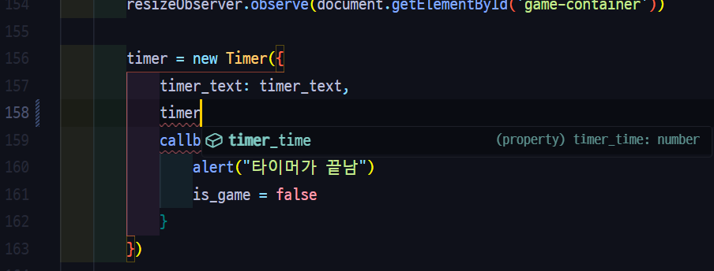

# 함수와 변수에 타입 지정하기

자, 이제 타입스크립트의 꽃, 함수와 변수에 타입을 지정하는 방법을 알려드리도록 하겠습니다. 이미 [타입스크립트란?](/typescript/what-is-typescript)에서 살짝 보여드리긴 했지만, 여기서 자세하게 알 수 있을 겁니다!
## 변수에 타입 지정하기

타입스크립트에서 변수에 타입을 지정할 땐

```typescript
let 변수이름: 타입 = 값;
```

이렇게 설정하시면 됩니다. 예를 들자면 이런 코드가 있겠죠.

```typescript
let pi: number = 3.141592653589;
```

하지만 여러분의 뒤통수를 화려하게 후려칠(그정도는 아닌가?) 반전이 하나 이 문법에 숨어 있습니다. 바로...
**값이 지정 될 경우에는 타입 표기가 필요 없다** 라는 점입니다.

맞습니다. 사실입니다. 타입스크립트의 변환기는 여러분들의 생각보다 훨씬 똑똑해서, 값이 지정 되었을 경우에는 알아서 그 값의 타입을 찾아 알아서 타입을 적용시켜줍니다. 그래서 위의 코드를 이렇게 바꿔도:

```typescript
let pi = 3.141592653589;
```

알아서 `number`로 타입을 지정해줍니다.

하지만 이런 생각을 하실 수도 있다고 봅니다.

> '그럼 타입스크립트의 변수에는 타입을 지정하지 않아도 되겠네?'

그렇지만 이 생각은 항상 맞지는 않습니다. 그때는 바로 **값이 지정되지 않았을때**입니다. 만약 값이 지정되지 않았을때 타입을 지정하지 않는다면, 변수는 `any`타입이 되게 됩니다. 

```typescript
let no_value; // 이 변수는 any 타입으로 지정됨!
```

그럼 변수에 아무 타입이나 들어올 수 있게 되고, 오류가 발생할 확률이 높겠죠. 그러니 값을 지정하지 않은 변수에는 반드시 타입을 쓰기로 합시다.

## 함수의 매개변수에 타입 지정하기

[타입스크립트란?](/typescript/what-is-typescript)단계에서 나온 함수를 다시 들고오겠습니다.

```typescript
function add_two_numbers(first, second) {
	return first + second
}
```

[타입스크립트란?](/typescript/what-is-typescript)에서 나온 두 숫자를 더하는 함수인 것 같습니다. 만약 이 변의 매개변수 first와 second에 타입을 지정하고 싶다면, 

```typescript
function 함수이름(매개변수: 타입) {}
```

이런 식으로 입력하면 됩니다. 그럼 두 매개변수의 타입을 `number`로 지정하려면:

```typescript
function add_two_numbers(first: number, second: number) {
	return first + second
}
```

이렇게 적으면 될 것입니다.

## 함수의 리턴 값에 타입 지정하기

여기 함수 하나가 있습니다.

```typescript
function return_apple() {
	return "🍎";
}
```

사과 모양의 이모지를 담는 문자열을 리턴하는 함수인듯 합니다. 근데 다른 곳에서 사용할때, 리턴 값을 모르면 이런 어마무시한 일이 일어 날 수도 있겠죠.

```typescript
const maybeAppleIsNumber: number = return_apple() * return_apple();
```

문자열 곱하기 문자열이라뇨? 심지어 `number`타입의 변수에다 문자열을 저장하려고 했군요. 이것은 리턴 값을 알수 없어서 생긴 불상사인 것 같습니다. 그리 심각해 보이지 않을수 있지만, 리턴 값을 모르면 실전상황에선 어떤 일이 일어날지 모릅니다. 그러니 함수의 리턴 값을 알 수 있으면 좋겠죠. 이럴때에는,

```typescript
function 함수이름(): 리턴타입 {}
```

이런 식으로 입력해서 변수의 리턴 타입을 지정 할 수 있습니다. 그렇다면 `return_apple`의 리턴 타입을 지정하려면,

```typescript
function return_apple(): string {
	return "🍎";
}
```

이렇게 적으면 될 것입니다.

## +) 리턴 값에서만 쓸 수 있는 타입 void

만약 함수에서 아무것도 반환하지 않는다면 어떻게 해야 할까요? 바로 `void`타입을 사용하는 것입니다. Java같은 언어에도 있는 타입입니다.

```java
void function() {
	// 여기에 리턴은 없습니다. 예 맞습니다. 없습니다. 진짜 없습니다.
}
```

그럼 타입스크립트에서 리턴 값을 `void`로 지정하려면 이렇게 하면 되겠죠?

```typescript
function print_apple(): void {
	console.log("🍎");
}
```

## 객체 형식의 매개변수 타입

만약 자바스크립트로 Vue나 React 같은 것들을 해보았다면 이런 형식으로 매개변수를 작성하는 경우를 본 적 있을 것입니다.



이 타입은 자바스크립트의 객체를 통해 매개변수를 받는 타입으로, 
많은 프레임워크/라이브러리/코드에서 이런 문법을 많이 사용합니다.
사용하는 방법은 다음과 같습니다:

```typescript
function 함수이름(객체이름: { 매개변수: 타입, 매개변수: 타입 }) {}
```

또한 선택적인 매개변수를 만들수도 있는데, 위의 함수의 객체 매개변수 부분을:

```typescript
{ 매개변수?: 타입, 매개변수?: 타입 }
```

이렇게 변경하면 됩니다.

:::tip
선택적인 매개변수는 기본 값이 undefined입니다. 그러니 실수로 비어있는 선택적인 매개변수를 사용하게 된다면 오류가 나게 될 가능성이 매우매우 높습니다. 그러니 선택적인 매개변수에 값이 들어있는지 확인하는 조건문을 추가하는게 좋겠죠?
:::

객체 형식으로 매개변수를 받았다면, 이렇게 사용하면 됩니다.

```typescript
객체이름.매개변수
```

이러한 타입을 사용하면 무엇이 좋을까요? 여러가지 이유중 하나는 바로 어떤 매개변수인지 구분하기 쉽다는 것입니다. 이런 함수가 있다고 쳐봅시다:

```typescript
function create_user(name: string, email: string, password: string) {
	user_list.push([name, email, password]);
}
```

어떤 사람이 이 함수를 사용한다고 쳐 봅시다. 그럼 코드는 이런 모습이 될 것입니다.

```typescript
create_user(
	"오늘도에러남", 
	"noerroragain@email.com", 
	"noerroragain1234!!"
);
```

근데 이 코드는 어떤 매개변수에 어떤 값이 들어가는지 알기가 매우 어렵습니다. (실전이라면 더더욱요.) 그래서 다른 사람이 보았을때 이해가 매우 어렵습니다. 하지만 객체 형식으로 매개변수를 만들면 어떻게 될까요?

```typescript
function create_user(data: { name: string, email: string, password: string }) {
	user_list.push([data.name, data.email, data.password]);
}
```

```typescript
create_user({
	name: "오늘도애러남",
	email: "noerroragain@email.com",
	password: "noerroragain1234!!"
});
```

훨씬 보기 편해졌죠? 다른 사람도 이해하기 편할 겁니다.

## 글을 마치며

이렇게 타입스크립트에서 함수와 변수에 타입을 지정하는 방법을 알아보았습니다. 다음으론 타입스크립트의 유니언 타입에 대해 배워보겠습니다.