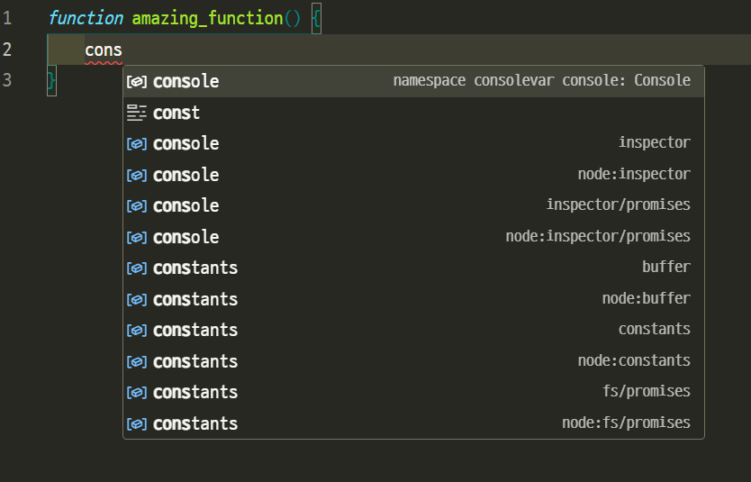

# 타입스크립트란?

만약 개발에 관심이 있거나, 자바스크립트를 아는 사람들은 **“타입스크립트”**
라는 언어를 들어봤을 겁니다. 타입스크립트는 최근 웹개발에서 많이 사용되며 마이크로소프트에서 만든 자바스크립트의 슈퍼셋입니다. 그럼 오늘은 타입스크립트의 문법으로 들어가기 전, 타입스크립트가 무엇인지에 대해 설명드리도록 하겠습니다.

## 타입스크립트란?

타입스크립트 문서에선 타입스크립트를 이렇게 소개합니다.

>“TypeScript의 목표는 JavaScript 프로그램의 정적 타입 검사자 입니다. 즉, 코드가 실행되기 전에 실행하고(정적), 프로그램 타입이 정확한지 확인하는 도구(타입 검사)입니다.

이것은 무슨 말일까요?
여러가지 설명을 할 수 있겠지만, 타입스크립트를 한마디로 표현하자면
**”변수에 뭐를 담는지 쓸수 있는 자바스크립트 업그레이드판“**
이라고 표현할 수 있겠네요.

## 타입스크립트의 기능

이 코드는 자바 코드입니다.<br>
```java
int variable = 10;
```

이 코드 앞에를 보면 int 라고 적혀 있습니다. 이것은 이 변수에 어떠한 종류의 값을 저장할 수 있는지 알려주는 단어입니다. 여기에는 int(정수값, 1, 2, 3…), double(소수, 0.1, 0.2, 3.14…)등의 키워드가 들어 갈 수 있습니다. 어떤 언어든 배워보신 분이라면 잘 알것이라 생각합니다.

하지만 일반 자바스크립트에는 이 기능이나 이런 비슷한 것도 (사실상)**없습니다.**

이 자바스크립트 코드를 보시면 알수 있습니다.<br>
```javascript
let variable = 10;
```

만약 이 변수를 다른곳에서 사용하려 하면 이 변수에 어떤 값이 들어갈수 있는지 전혀 모르게 됩니다. 이러면 프로그래밍을 하면서 여러 문제가 발생할 수 있겠죠.

**이런 상황을 방지하기 위해 나온 것이 타입스크립트입니다.** 타입스크립트는 변수에 타입을 지정할 수 있습니다. 이렇게 말이죠:

```typescript
let variable: number = 10;
```

이게 정말 웹개발에서 타입스크립트를 정말 많이 사용하는 이유입니다. 근데 사실 이것 말고도 더 많은 기능이 있는데, 예를 들자면

* 타입 별칭 만들기
* 클래스 기능
* 열거형

등의 기능이 있지만 지금으로썬 이것들을 억지로 배우려 노력할 필요는 없습니다.

## 타입스크립트는 왜 쓰는 걸까?

### 1. 타입 에러를 없에기 위해

앞에서 말했다 싶이, 자바스크립트의 변수는 타입을 지정할수 없는 동적 변수입니다. 그렇기에 타입과 관련된 오류가 발생하기도 하죠.

비유해서 표현해볼게요. 여기 상자가 하나 있다고 쳐 봅시다. 이 상자에는 무언가를 담을 수 있는데, 다른 상자와는 다르게, 이 상자는 **뭐를 담을 수 있을지 알려주지도, 정해놓지도 않습니다.** 그래서 이 상자에 사과를 담든, 배를 담든, 사과인척하는 두둑한 현금을 담든상관이 없는거죠.(알 수도 없고요.)
이제 어떤 사과주스 공장에서 그 상자에 담긴 사과를 주문했다 쳐봅시다. 이제 사과주스를 만들어서 일확천금의 기회를 노리며 히히덕 거리던 공장장이 사과 상자를 열었는데…
어랍쇼? 왜 아주 두둑한 돈뭉치들이 들어있는 거지?
(일확천금의 기회일수는 있으나)이러면 많이 곤란해집니다. 이 돈들을 짜서 돈주스를 만들수도 없는 노릇이죠! 마시면 펄프 맛이 날겁니다.

하지만 타입스크립트는 **상자에 무엇을 넣는지 정해버릴 수** 있기 때문에 이러한 사태는 발생하지 않습니다. 그러니까, 
“이제부터 이 상자에는 사과밖에 못담아!”
이렇게 지정할 수 있다는 것이죠. 이러면 완벽한 사과주스를 만들 수 있겠죠?

### 2. 자동완성을 잘 사용하기 위해

모든 IDE(예를 들자면 비주얼 스튜디오, 비주얼 스튜디오 코드, 파이참, 인텔리제이 같은 게 있겠죠)에는 자동완성이라는 기능이 존재합니다.



사실 이것을 위해(IDE에는 여러가지 기능이 있기는 하지만) IDE를 쓴다고 해도 과언이 아닙니다. 자바스크립트(비주얼 스튜디오 코드)에서도 자동완성이 매우 유용하게 사용되지만, **타입을 지정하지 못한다는 점 때문에 문제가 생기기도 합니다.**

이 코드로 예를 들어봅시다:

```javascript
function add_two_numbers(first, second) {
	return first + second
}
```

아, 두 숫자를 매개변수로 받은 뒤 두 숫자를 더한 값을 반환하는 함수네요. 근데 만약 다른 곳에서 이 함수를 사용하려고 하면, 어떤 값을 함수에 넣어야 하는지 전혀 모르게 됩니다. 그렇게 되면

```javascript
console.log(add_two_numbers("pizza", 1)) // error!
```

이렇게 함수를 사용하게 되는 정말 끔찍한 상황이 발생할수 있습니다. 적어도 여러분이 가지고 있는 지식으로는 pizza라는 단어와 1을 더할수는 없다고 아시겠죠. 근데 컴퓨터는 멍청해서 그대로 더해버리고, 그렇게 된다면 **어떤 나비효과가 일어날지는 아무도 모르게 되겠죠.** 그럼, 이 함수에 어떤 값을 넣어야 하는지 알수 있다면 얼마나 좋을까요? <br>

(추가: 근데 확인을 해보니까 자바스크립트에서 "pizza" + 1 이 "pizza1"로 나오더라고요? 다른 언어에서도 이건 오류가 날텐데 말입니다. 상식이 부정당하는 기분이군요)

하지만 타입스크립트는 이 점을 완전히 보완할수 있습니다. **어떤 값을 넣어야 하는지 알 수 있으니, 어떻게 입력해야 하는지 알수 있기 때문입니다!** 이렇게 말이죠:

```typescript
function add_two_numbers(first: number, second: number) {
	// 매개 변수에 타입이 추가됨!
	return first + second
}
```

그렇게 된다면 오류가 나지 않게 하기 위해 파일을 들락날락 거리며 시간을 그대로 버리지 않아도 되고, 코드 작성과 기능 구현에 **엄청난 이점이 생기게 됩니다!**

## 글을 마치며

이렇게 타입스크립트가 어떤 언어인지, 어떤 기능을 가지고 있고 왜 쓰는지까지 알아보았습니다. 다음으론 타입스크립트 설치 및 적용법에 대해 알아보도록 하겠습니다.